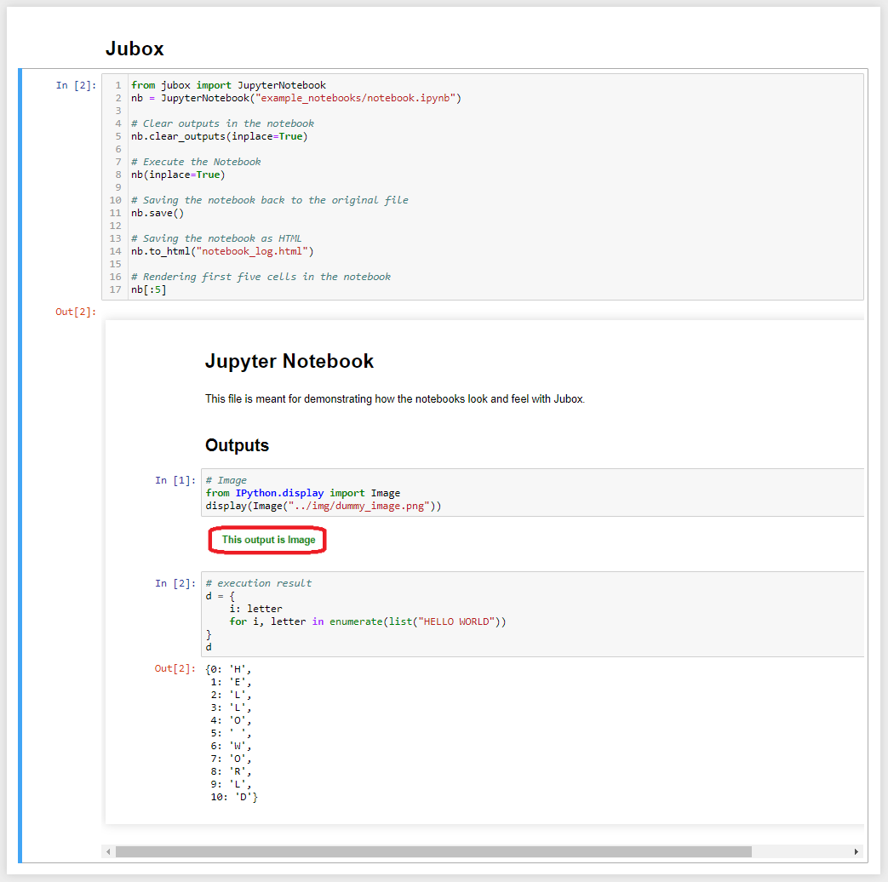

# JuBox
[](https://travis-ci.com/Miksus/jubox)

> Programmatical Jupyter Notebook API for humans

> Jupyter Notebook extension, Python 3, Easy to use


---



## What?
- Pythonic approach to load, modify, run and save Jupyter Notebooks in Python code
- This enables to quickly and easily create:
    - Parametrized notebooks
    - Version controlable notebooks directly from inserted code snippets, Python files or even straight from Python functions and classes.
    - Notebooks with code generated markdown

## Installation

- Pip install from pip
```shell
pip install jubox
```

- Clone the source code and pip install:
```shell
git clone https://github.com/Miksus/jubox.git
cd jubox
pip install -e .
```

## Example

See [demo](docs/Demo.ipynb) or [cook book](docs/cookbook/README.md) for detailed examples. 

```python
from jubox import JupyterNotebook, CodeCell

# Load jupyter Notebook
nb = JupyterNotebook("my_file.ipynb")
nb.load()

# Run the notebook
# by making a copy (output is lost if raised exception)
nb_runned = nb()

# or in place (maintains exceptions in the notebook)
nb(inplace=True)


# save the file to the original file
nb.save()
# or to new file
nb.to_ipynb("run_notebook.ipynb")


# Get cells with specific tags
param_cells = nb.cells.get(tags=["parametrized"])

# Rewrite the first tagged cell with dict of parameters
new_cell = CodeCell.from_variable_dict(run_date="2020-01-01", category="blue")
param_cells[0].overwrite(new_cell)

```


---

## Features
- Convenient object oriented API for Jupyter Notebooks.
- API includes:
    - Load, save and run notebooks in Python
    - Conveniently select specific cells using tags, source, regex or the type
    - Conveniently select specific outputs of a cell and render it to HTML or plain text
    - Render Jupyter Notebooks in a Jupyter Notebook!

## Test
Pytest was chosen as testing suites. Tests are found in test directory inside the source. 


---

## Author

* **Mikael Koli** - [Miksus](https://github.com/Miksus) - koli.mikael@gmail.com

---
## License

- **[MIT license](http://opensource.org/licenses/mit-license.php)**